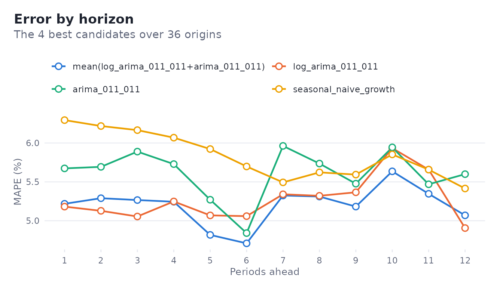
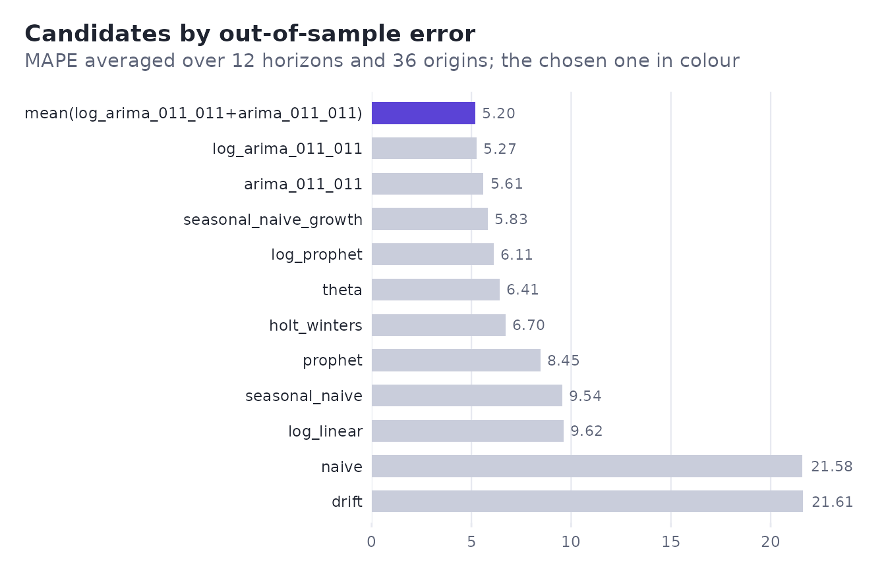
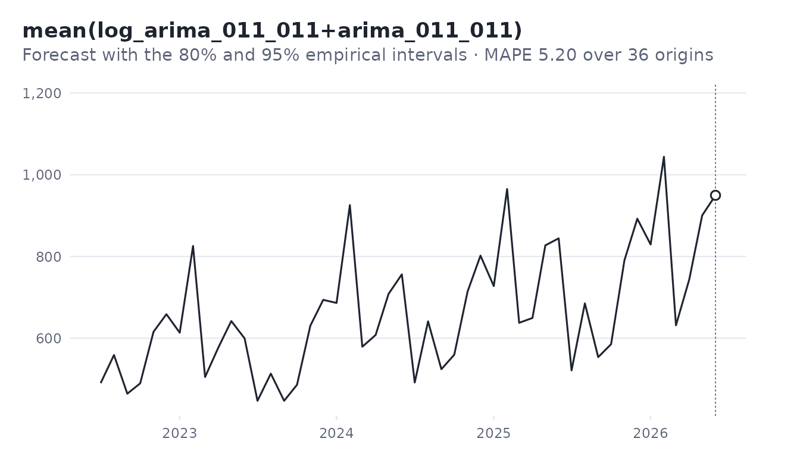
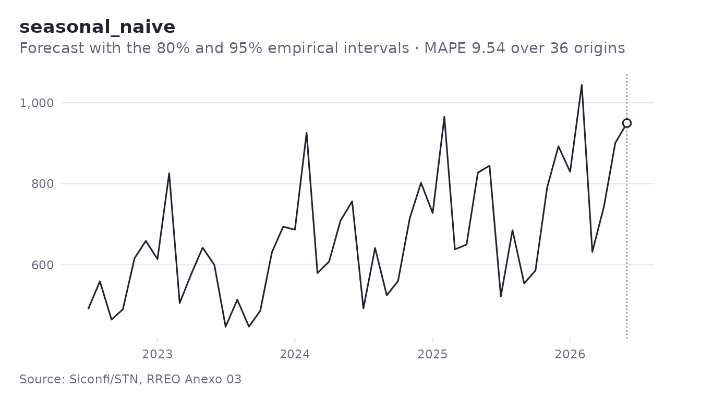

# The backtest and its intervals

``` r

library(foresightr)
path <- system.file("extdata", "piaui_revenue.csv", package = "foresightr")
data <- read.csv(path, comment.char = "#")
# BRL million, monthly from March 2017
fpe <- ts(data$fpe / 1e6, start = c(2017, 3), frequency = 12)
```

## Replaying the past


A rolling-origin backtest stands at each of the last `origins` periods
of the series, fits every candidate on the data before that point only,
and forecasts up to `horizon` periods ahead. Each forecast is compared
with what actually happened. Nothing a model sees at an origin comes
from after it.

``` r

bt <- backtest(fpe, origins = 36, horizon = 12)
bt$origins
#> [1] 36
bt$first_origin   # position of the first period forecast
#> [1] 77
```

Series shorter than `min_train` plus the origins get fewer origins;
`window` trains on the last observations only, for series whose
behaviour changed. A candidate that cannot forecast at every origin and
from the whole series is left out, with a warning, and named in
`bt$dropped`.

## The error by horizon

Each candidate keeps its errors one horizon at a time: the pairs
evaluated, the mean absolute percentage error, the bias (positive when
forecasts ran high), MAE, RMSE and MASE. Errors usually grow with the
horizon; for this series, dominated by a stable seasonal pattern, they
hardly do.

``` r

acc <- bt$candidates[[bt$best]]$accuracy
acc[c(1, 3, 6, 12), ]
#> # A tibble: 4 × 7
#>   horizon     n  mape      bias   mae  rmse  mase
#>     <int> <dbl> <dbl>     <dbl> <dbl> <dbl> <dbl>
#> 1       1    36  5.22  0.483     35.0  44.6 0.543
#> 2       3    34  5.27 -0.000876  36.8  45.5 0.572
#> 3       6    31  4.71 -0.514     34.4  43.2 0.534
#> 4      12    25  5.07 -0.441     34.3  41.0 0.534
```

``` r

autoplot(bt, "accuracy")
```



The ranking averages the chosen `metric` over the horizons. The last
candidate is the simple average of the best `combine` models, often
better than either:

``` r

bt$ranking[order(bt$ranking$score), c("name", "score")][1:5, ]
#> # A tibble: 5 × 2
#>   name                                  score
#>   <chr>                                 <dbl>
#> 1 mean(log_arima_011_011+arima_011_011)  5.20
#> 2 log_arima_011_011                      5.27
#> 3 arima_011_011                          5.61
#> 4 seasonal_naive_growth                  5.83
#> 5 log_prophet                            6.11
```

``` r

autoplot(bt, "ranking")
```



Changing the metric changes the ranking only when models trade accuracy
in different ways; `"mase"` scales the errors by the seasonal naive
error of each training set, which makes series of different sizes
comparable.

## Intervals from the errors actually made

An interval here is not derived from a distribution. At each horizon,
the backtest collects the relative errors `actual / forecast - 1` of the
candidate and takes their quantiles: the 80% interval goes from the 10%
to the 90% quantile. The bands are kept in relative terms and applied to
the final forecast.

``` r

bt$candidates[[bt$best]]$bands[c(1, 6, 12), ]
#> # A tibble: 3 × 5
#>   horizon lower_80 upper_80 lower_95 upper_95
#>     <int>    <dbl>    <dbl>    <dbl>    <dbl>
#> 1       1  -0.0881   0.0750  -0.140     0.110
#> 2       6  -0.0637   0.0812  -0.0832    0.132
#> 3      12  -0.0684   0.0838  -0.0959    0.138
bt$forecast[c(1, 6, 12), ]
#> # A tibble: 3 × 7
#>   horizon time        mean lower_80 upper_80 lower_95 upper_95
#>     <int> <date>     <dbl>    <dbl>    <dbl>    <dbl>    <dbl>
#> 1       1 2026-07-01  624.     569.     670.     537.     692.
#> 2       6 2026-12-01  995.     932.    1076.     912.    1127.
#> 3      12 2027-06-01 1037.     966.    1124.     937.    1180.
```

With 36 origins, the 95% bounds rest on few errors at long horizons;
they are honest about the past but not smooth. More origins give
steadier bands, at the cost of judging models on older data.

The trajectories of the backtest are kept, one row per origin, should
you want another summary of them:

``` r

dim(bt$candidates[[bt$best]]$trajectories)
#> [1] 36 12
```

## Totals

Budgets are about totals: the revenue of the rest of the year, not of
each month. The backtest also measures the error of the sum of the first
k periods, so the total gets its own interval:

``` r

total_forecast(bt, 6)
#> # A tibble: 1 × 6
#>   periods  mean lower_80 upper_80 lower_95 upper_95
#>     <int> <dbl>    <dbl>    <dbl>    <dbl>    <dbl>
#> 1       6 4632.    4486.    4911.    4271.    4923.
```

Adding up the six monthly bounds would overstate the uncertainty:
monthly errors partly cancel in a sum.

``` r

colSums(bt$forecast[1:6, c("mean", "lower_80", "upper_80")])
#>     mean lower_80 upper_80 
#> 4631.779 4302.830 5000.857
```

## Looking at it

The charts are ggplot2 objects, drawn with
[`theme_foresight()`](https://strategicprojects.github.io/foresightr/reference/theme_foresight.md);
they can be themed and annotated further.

``` r

autoplot(bt)
#> Warning: Removed 12 rows containing missing values or values outside the scale range
#> (`geom_line()`).
#> `geom_line()`: Each group consists of only one observation.
#> ℹ Do you need to adjust the group aesthetic?
```



Any candidate can be plotted or inspected by name:

``` r

autoplot(bt, candidate = "seasonal_naive") +
  ggplot2::labs(caption = "Source: Siconfi/STN, RREO Anexo 03")
#> Warning: Removed 12 rows containing missing values or values outside the scale range
#> (`geom_line()`).
#> `geom_line()`: Each group consists of only one observation.
#> ℹ Do you need to adjust the group aesthetic?
```


