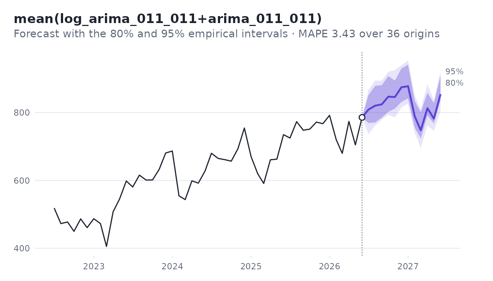
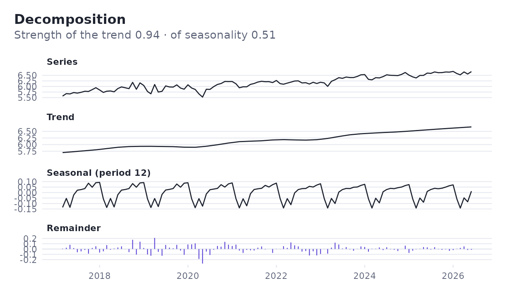

# Get started

A model that fits the past well can still forecast badly. `foresightr`
chooses models the other way round: it replays the past, and at each
point forecasts with what was known then.

``` r

library(foresightr)
```

## The data

Monthly ICMS, the main tax revenue of the Brazilian state of Piauí, from
the public fiscal reports (Siconfi/STN). The first observation is March
2017.

``` r

path <- system.file("extdata", "piaui_revenue.csv", package = "foresightr")
data <- read.csv(path, comment.char = "#")
# BRL million, monthly from March 2017
icms <- ts(data$icms / 1e6, start = c(2017, 3), frequency = 12)
```

## Choose a model by what would have worked

[`backtest()`](https://strategicprojects.github.io/foresightr/reference/backtest.md)
refits every candidate at each of the last 36 months, using only the
data before it, and forecasts up to 12 months ahead. The candidates are
ranked by their mean absolute percentage error, the average of the best
two is added as one more candidate, and the best of all forecasts from
the whole series.

``` r

bt <- backtest(icms)
bt
#> <foresight backtest> 12 candidates, 36 origins, 12 periods ahead
#> Chosen: mean(log_arima_011_011+arima_011_011) (MAPE 3.427)
#> 
#>                                     name score
#> 1  mean(log_arima_011_011+arima_011_011) 3.427
#> 2                      log_arima_011_011 3.654
#> 3                          arima_011_011 3.868
#> 4                            log_prophet 4.749
#> 5                                prophet 5.508
#> 6                             log_linear 5.538
#> 7                           holt_winters 7.293
#> 8                                  theta 7.502
#> 9                                  drift 7.857
#> 10                                 naive 8.548
#> ... and 2 more
```

The forecast of the chosen candidate, with intervals that are quantiles
of the errors it made in the backtest, horizon by horizon:

``` r

head(bt$forecast)
#>   horizon     time     mean lower_80 upper_80 lower_95 upper_95
#> 1       1 2026.500 808.7847 769.5044 851.5913 736.8256 866.9912
#> 2       2 2026.583 820.3222 770.5018 878.9813 761.8516 894.4362
#> 3       3 2026.667 824.3435 785.6634 880.5138 779.0537 894.0897
#> 4       4 2026.750 846.9183 802.2410 907.6957 793.4335 920.1498
#> 5       5 2026.833 845.9071 811.9032 894.3556 785.9314 925.1126
#> 6       6 2026.917 874.5325 831.2537 929.7832 815.2608 939.4974
plot(bt)
```



The error of each candidate by horizon:

``` r

head(bt$candidates[[bt$best]]$accuracy)
#>   horizon  n     mape       bias      mae     rmse      mase
#> 1       1 36 3.533275 -0.1807961 23.80781 28.58104 0.3668870
#> 2       2 35 3.607359 -0.3744145 24.22882 30.64350 0.3742738
#> 3       3 34 3.541903 -0.4923517 24.05555 29.64415 0.3716752
#> 4       4 33 3.305940 -0.6916501 23.09730 29.89687 0.3577268
#> 5       5 32 3.423529 -1.0062653 23.77651 29.91922 0.3682181
#> 6       6 31 3.633728 -1.0319047 25.08311 30.95968 0.3898493
```

## Totals

The total of the next six months has its own interval, measured on
totals in the backtest. Adding up the monthly limits would give a wider
and wrong interval, because the errors of successive months partly
cancel.

``` r

total_forecast(bt, 6)
#>   periods     mean lower_80 upper_80 lower_95 upper_95
#> 1       6 5020.808 4879.802 5248.267 4866.549 5339.277
```

## One model on its own

``` r

fit <- fit_model(model_auto_arima(), log(icms))
fit$details$order
#> [1] 0 1 1
fit$details$seasonal_order
#> [1] 0 0 2
exp(predict(fit, 6))
#>           Jul      Aug      Sep      Oct      Nov      Dec
#> 2026 774.9555 782.2726 777.0182 777.1299 784.6480 788.9186
```

## Your own candidates

Any list of models works, renamed as you like; ensembles learn their
weights again at every origin of the backtest.

``` r

mine <- list(
  with_name(model_seasonal_naive(), "same_month"),
  model_log(model_airline()),
  model_ensemble(candidates_default(), weighting = "stacked")
)
backtest(icms, mine, origins = 24, horizon = 6)$ranking[, c("name", "score")]
#>                                       name    score
#> 1                               same_month 9.927648
#> 2                        log_arima_011_011 4.288811
#> 3                         ensemble_stacked 3.881882
#> 4 mean(ensemble_stacked+log_arima_011_011) 3.644656
```

## Decomposition

``` r

d <- decompose_stl(log(icms), seasonal_window = 13)
d
#> <foresight decomposition> 112 observations, period 12
#> Strength of the trend: 0.939
#> Strength of seasonality (12): 0.515
plot(d)
```


